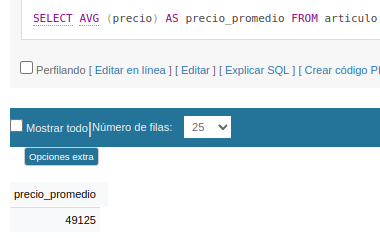

## consulta1

Obtener los nombres de los productos de la Zapateria

## Consulta 2 

Obtener los nombres y los precios de los productos de la Zapatería.

## Consulta 3 

Obtener el nombre de los productos cuyo precio sea menor o igual a 50000

## Consulta 4

Obtener todos los datos de los artículos cuyo precio esté entre 5000 y 40000 (ambas canditades incluidas)

## Consulta 5

Obtener el nombre y el precio de cada artículo, en dolares.

## Consulta 6

Obtener el precio promedio de todos los artículos

## Consulta 7

Obtener el precio medio de los artículos cuyo codigo de fabricante sea 2.

## Consulta 8

Obtener el número de artículos cuyo precio sea mayor o igual a 50000

## Consulta 9

Obtener el nombre y precio de los artículos cuyo precio sea mayor o igual a 50000 y ordenarlos descendentemente por precio, y luego ascendentemente por nombre.

## Consulta 10

Obtener un listado completo de artículos, incluyendo por cada articulo los datos del artículo y de su fabricante.

## Consulta 11

Obtener un listado de articulos, incluyendo el nombre del articulo, su precio y el nombre de su fabricante.

## Consulta 12

Obtener el precio medio de los productos  de cada frabricante, mostrando solo los codigos de fabricante.

## Consulta 13

Obtener el precio medio de los productos de cada fabricante, mostrando el nombre del fabricante.

## Consulta 14

Obtener el nombre de los fabricantes que ofrezcan productos cuyo precio medio sea mayor o igual a 50000

## Consulta 15

Obtener el nombre y el precio del artículo mas barato.

